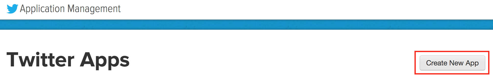
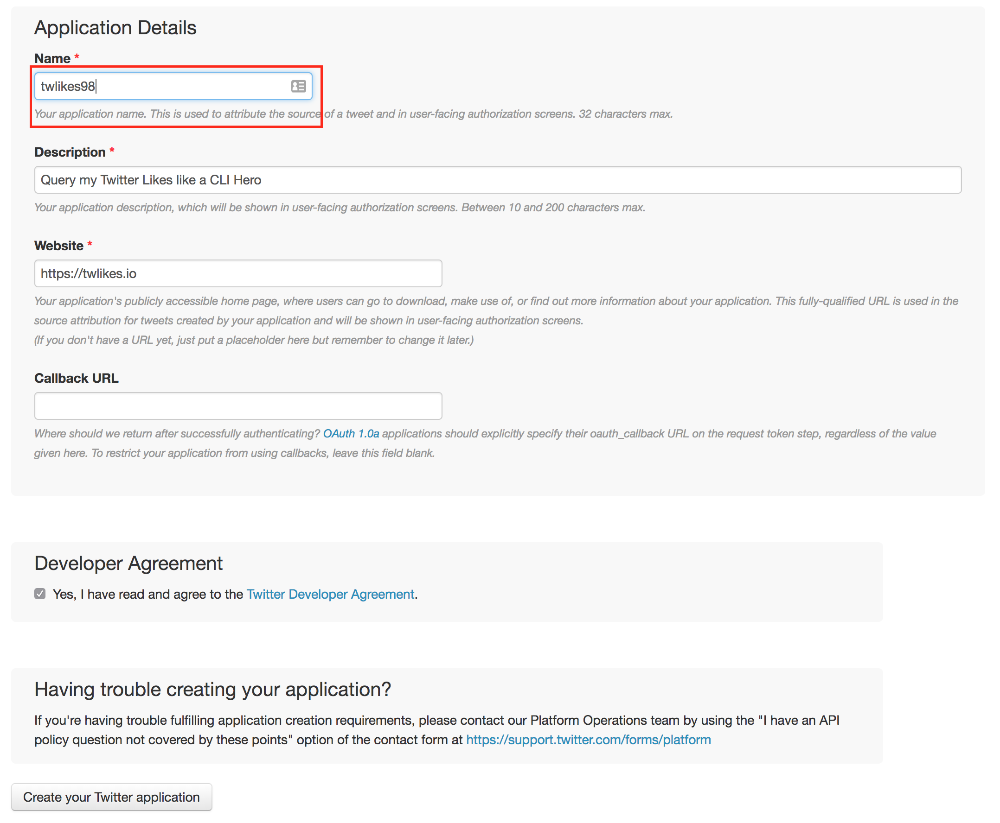
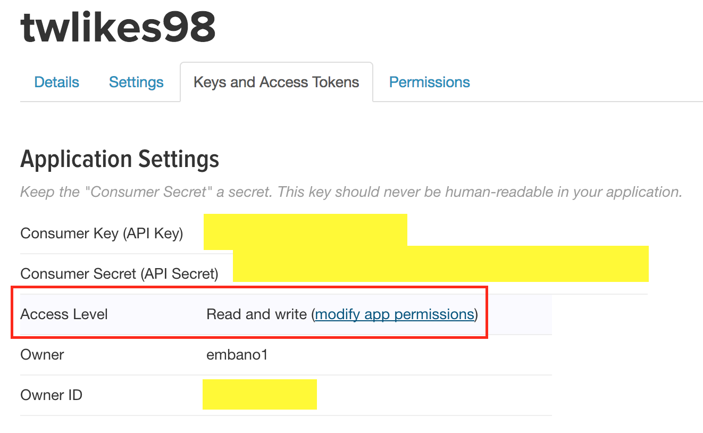
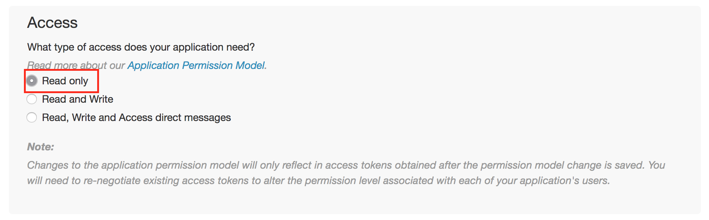
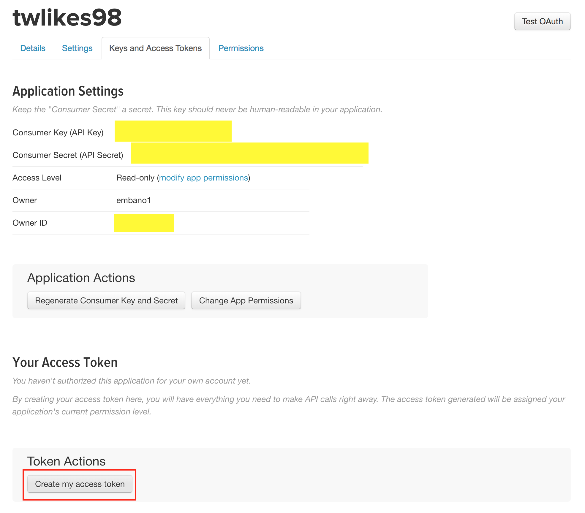
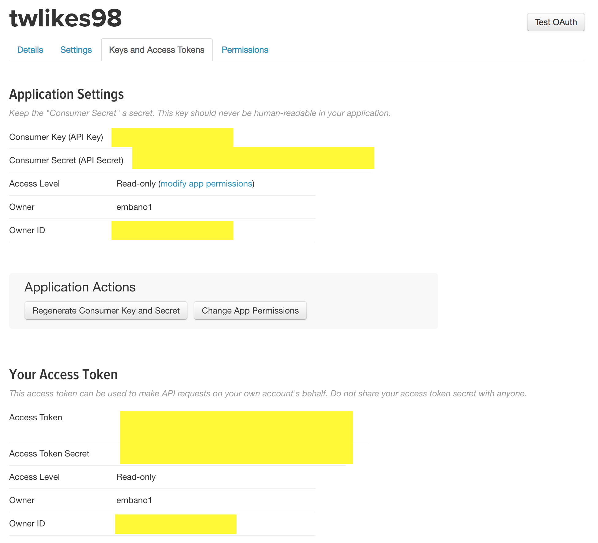

# What does it?
It turned out that it's not just me who (ab)uses the Twitter `Like` button for a "read later" list :)  
`tw` is a very basic Twitter client to query your Likes, and do some powerful JSON filtering (see examples below). 

Currently, only `Likes` can be queried. `tw` is expandable though ;)

Please keep ideas and bugs coming (file an Issue).

# Get it
## Releases (Binaries)
Download a release for `OSX`, `Windows` and `Linux` from the [Releases](https://github.com/embano1/tw/releases) page.

## Docker
`docker pull embano1/tw`

## Build
Requires a working [go](https://golang.org/) environment and `$GOPATH` set.

```bash
$ go get -v -d -u github.com/embano1/tw
$ cd $GOPATH/src/github.com/embano1/tw
# Builds a static binary for your GOOS
$ make
```

# Usage 
**Note**  
You first need to set up authentication, see "Authentication" section below.

After you downloaded a release and with authentication set up:
```bash
# OSX/ Linux Quick start with your credentials in <HOME>/auth.json
$ ./tw likes -f ~/auth.json -p
...
```

Or with `Docker` installed:
```bash
# Quick start with your credentials in <HOME>/auth.json
$ docker run --rm -v ~/auth.json:/auth.json embano1/tw -f /auth.json -p likes
...

# If you have a JSON parser like 'jq' installed, this works as well
$ docker run --rm -v ~/auth.json:/auth.json embano1/tw -f /auth.json likes | jq '.[]|"---------",.user.screen_name,.full_text,.entities.urls[].expanded_url'
...
```

## Help and Flags
```
$ ./tw --help                                                                    
usage: tw [<flags>] <command> [<args> ...]


    ______   __     __    
   /\__  _\ /\ \  _ \ \   
   \/_/\ \/ \ \ \/ ".\ \  
      \ \_\  \ \__/".~\_\ 
       \/_/   \/_/   \/_/ 
  
    A minimal Twitter CLI
          
    This application uses Oauthv1 to securely authenticate requests.
    You can obtain API credentials from https://apps.twitter.com/.
    Always handle secrets carefully!
    
    If you don't provide a credentials file, please provide credentials via the following environment variables: 
    TW_CONSUMER_KEY, TW_CONSUMER_SECRET, TW_ACCESS_TOKEN, TW_TOKEN_SECRET
                  
Flags:
  -h, --help       Show context-sensitive help (also try --help-long and --help-man).
  -v, --version    Show application version.
  -f, --file=FILE  Path to a JSON file containing auth credentials
  -p, --pretty     Pretty print instead of JSON (default: JSON)

Commands:
  help [<command>...]
    Show help.

  likes
    Get your likes
```

# Filtering with `jq`

> [jq](https://stedolan.github.io/jq/) is like sed for JSON data.  
> You can use it to slice and filter and map and transform structured data with the same ease that sed, awk, grep and friends let you play with text.
>
> [Tutorial](https://stedolan.github.io/jq/tutorial/) and [Manual](https://stedolan.github.io/jq/manual/)

## Examples

```bash
# Nicer JSON output
$ ./tw -f auth.json likes | jq '.'    

# Count number of your likes
$ ./tw -f auth.json likes | jq '[.[].id]|length'    

# Query links in your likes
$ ./tw -f auth.json likes | jq '.[].entities.urls[].expanded_url'  

# Print username and Tweet text
$ ./tw -f auth.json likes | jq '.[]|"---------",.user.screen_name,.full_text'  
```

# Authentication

This application uses Oauthv1 to securely authenticate requests. You can obtain API credentials from https://apps.twitter.com/. See below for a detailed description.  
**Always handle secrets carefully!**

## Authenticate `tw` via File 
```bash
# Create auth.json file in the 'tw' folder, e.g. on Linux/ OSX
$ touch auth.json
```

Copy and paste everything below into `auth.json` (replace values with your own).

```json
{
    "Consumer_Key": "AAAAAAAAAAAAAAAAAAAAA",
    "Consumer_Secret": "AAAAAAAAAAAAAAAAAAAAA",
    "Access_Token": "1234567-AAAAAAAAAAAAAAAAAAAAA",
    "Access_Token_Secret": "AAAAAAAAAAAAAAAAAAAAA"
}
```

Test it...

```bash
$ ./twfaves -f auth.json -p
```

## Authenticate `tw` via Environment Variables
```bash
# OSX/ Linux
export TW_CONSUMER_KEY=AAAAAAAAAAAAAAAAAAAAA
export TW_CONSUMER_SECRET=AAAAAAAAAAAAAAAAAAAAA
export TW_ACCESS_TOKEN=1234567-AAAAAAAAAAAAAAAAAAAAA
export TW_TOKEN_SECRET=AAAAAAAAAAAAAAAAAAAAA
```

Test it...

```bash
$ ./twfaves -p
```

## Step-by-Step Guide to create Authorization Credentials

Log in at [https://apps.twitter.com](https://apps.twitter.com) your Twitter account. Select `Create New App`.



Insert application details. Note: the name must be a unique (not already taken), e.g. append a number.



Create application and click on `Key and Access Tokens`. Bonus point: reduce permissions to `Read Only` (`tw` does not require write access).





Now click `Create my access token`.



Use `Consumer Key`, `Consumer Secret`, `Access Token`, and `Access Token Secret` in your auth.json file or set the corresponding environment variables. 



